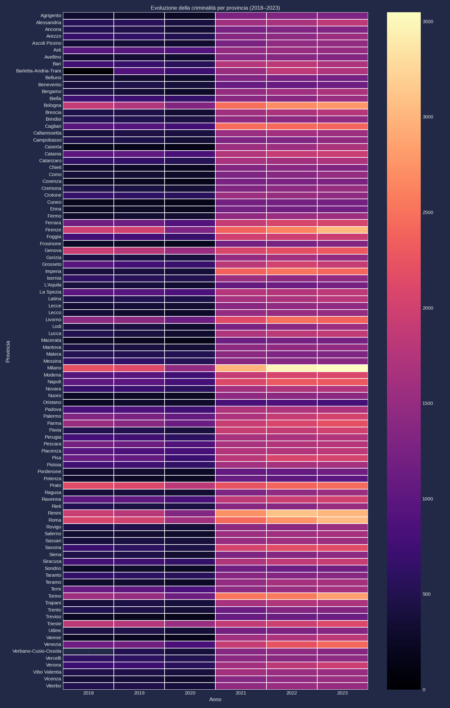

[](https://www.python.org/)
[](https://pandas.pydata.org/)
[](https://powerbi.microsoft.com/)
[](LINK_PUBBLICO_DEL_NOTEBOOK)
[](LICENSE)


# 🔍 datAxys


**Agency esperta di data analytics, impegnata in un progetto di analisi per esplorare la relazione tra criminalità ed economia nel nostro Paese.**

## 👥 Team
- **Davide Bruseghin** – Economist Specialist & Data Provider
- **Gabriele De Carlo** – Data Insights & Statistician
- **Alessandro Ferilli** – Data Engineer  &  Structural Archetype
- **Valeria Gangi** – Data Manipulation & Visualization Specialist 
- **Roman Luciano** - Business Intelligence & Storyteller 

---
### 🎯 Obiettivi del Progetto

1. **Consolidamento Dati:** Unire set di dati eterogenei (Delitti, Popolazione, Spesa Pubblica) provenienti da fonti istituzionali (Ministero dell'Interno, ISTAT).
2. **Normalizzazione:** Pulizia e standardizzazione dei dati per permettere confronti regionali e temporali omogenei.
3. **Analisi di Correlazione:** Esplorare la relazione tra il **Tasso di Delittuosità per 100.000 abitanti** e la **Popolazione** e la **Spesa Pubblica** regionale.

---
## 📝 Methodology

**Analysis Pipeline:**
1. **Data Collection** - ISTAT, Eurostat APIs
2. **Data Cleaning** - Standardization, NULL handling, Excel consolidation
3. **Feature Engineering** - Crime rates per capita, economic indicators
4. **Statistical Analysis** - Correlation, regression, hypothesis testing
5. **Visualization** - Interactive Power BI dashboard
6. **Insights** - Business recommendations

---
## 🛠️ Tech Stack

- **Data Processing:** Python (Pandas, NumPy)
- **Statistical Analysis:** SciPy, Statsmodels
- **Visualization:** Matplotlib, Seaborn, Power BI
- **Notebook Environment:** Google Colab
- **Version Control:** Git, GitHub
---
## 📂 Project Structure

[Setup](#-setup-locale-5-minuti) | [Requirements](#-requirements)

```
notebooks/          # Jupyter notebooks (analysis pipeline)
data/raw            # All dataset
data/processed/     # Clean datasets (CSV)
visualizations/     # Power BI dashboard
graphs/             # Pre-visualization graphs
```
## 📁 Dataset
- `delitti_completi_2018_2023.csv` - Delitti aggregati [**Scarica**](https://raw.githubusercontent.com/dataxys/crime_economy_italy_analysis/a5ed07a05da6fb4f38b20475f6be49087f3c5a00/data/processed/delitti_completi_2018_2023.csv)
- `dataset_finale_powerbi.csv` - **Dataset completo per Power BI** [**Scarica**](https://raw.githubusercontent.com/dataxys/crime_economy_italy_analysis/a5ed07a05da6fb4f38b20475f6be49087f3c5a00/data/processed/dataset_finale_powerbi.csv)
## 📁 Dataset

* [**delitti_completi_2018_2023.csv** - Delitti aggregati](https://raw.githubusercontent.com/dataxys/crime_economy_italy_analysis/a5ed07a05da6fb4f38b20475f6be49087f3c5a00/data/processed/delitti_completi_2018_2023.csv)
* [**dataset_finale_powerbi.csv** - Dataset completo per Power BI](https://raw.githubusercontent.com/dataxys/crime_economy_italy_analysis/a5ed07a05da6fb4f38b20475f6be49087f3c5a00/data/processed/dataset_finale_powerbi.csv)
---
## 📊 Sample Visualizations

[](https://colab.research.google.com/github/dataxys/crime_economy_italy_analysis/blob/main/notebooks/analysis.ipynb)

Analisi della relazione tra criminalità ed economia nelle province italiane.

## Trend Nazionale


## Top 15 Province per Criminalità


## Criminalità vs PIL


## Evoluzione Temporale


## ## 📈 Key Findings

## 🔑 KEY INSIGHTS

### 1. **Correlazione debole tra PIL e criminalità**
- Province ricche ≠ Più/Meno crimini
- PIL non predice direttamente la criminalità

### 2. **Popolazione è il fattore principale**
- Dimensione provincia spiega meglio i crimini totali
- Normalizzazione essenziale per confronti

### 3. **Outlier territoriali**
- Alcune province hanno dinamiche uniche
- Es: Milano, Roma, Napoli

### 4. **Normalizzazione cambia tutto**
- Crimini assoluti vs per 100k: storie diverse
- Province piccole possono avere tassi alti

### 5. **PIL ≠ Sicurezza**
- Relazione complessa
- Altri fattori: disoccupazione, istruzione, servizi

📊 **Interactive Dashboard:** [Link to Power BI Public](#)

---
## 📄 License

This project is licensed under MIT License - see [LICENSE](LICENSE) for details.

---
## 🙏 Acknowledgments

- **Boolean Academy** - Data Analytics Course
- **ISTAT** - Italian National Institute of Statistics
- **Eurostat** - European Statistics Database

---

